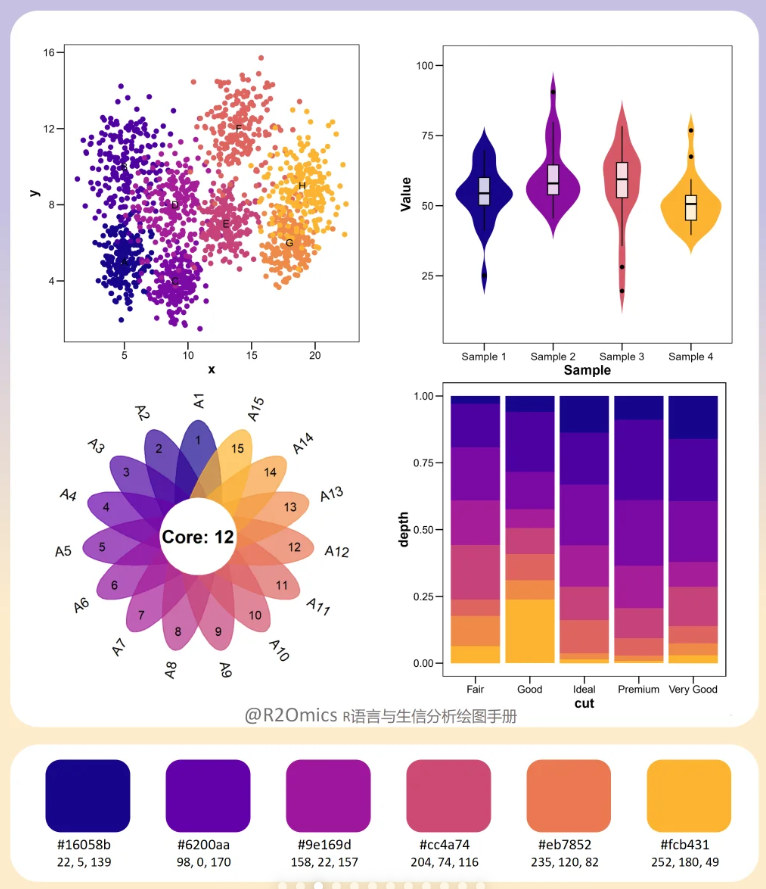

# 📄 Academic LaTeX Writing & Submission Checklist

This checklist is designed to help you systematically prepare and polish academic papers for top conferences and journals (e.g., ICML, NeurIPS, CVPR). It incorporates widely recommended best practices, formatting standards, and common reviewer expectations. Follow this list carefully to improve clarity, consistency, and chances of smooth acceptance.

---

## 🗂️ Sec2. Related Work

- [ ] ✅ Use **Related Work**, not "Related Works"
- [ ] ✅ Use `\citet{}` when the authors are the subject ("Smith et al. (2019) showed…").
- [ ] ✅ Use `\citep{}` when in parentheses ("...as shown in recent works \citep{smith2019, johnson2020}.").
- [ ] ✅ Follow "Authors et al. + verb (past tense)" and "Method name + verb (present tense)" convention.
- [ ] ✅ Avoid improper quotation marks: `"Hello, World!”` → ```Hello, World!''`

---

## 💡 Sec3. Method

### ✨ Spacing and Formatting

- [ ] ✅ Control **spacing**: use `\vspace(-1ex)` (relative unit that scales with font size), easier than cm.

### 🔤 Notations

- [ ] ✅ Use `\top` for transpose instead of `^T`
- [ ] ✅ **Vector and Matrix**: use bold (`\mathbf{x}`, `\mathbf{W}`)
- [ ] ✅ **Set**: use calligraphic fonts (`\mathcal{L}`)
- [ ] ✅ Use **fraktur** for algebraic structures: `\mathfrak{g}` ($\mathfrak{g}$)
- [ ] ✅ Use **sans-serif** for random variables or distributions: `\mathsf{X}` ($\mathsf{X}$)
- [ ] ✅ Proper **norm** notation: $\| x \|$ instead of $||x||$
- [ ] 🔗 Reference: [Comprehensive LaTeX Math cheatsheet](https://zhuanlan.zhihu.com/p/522724800)
- [ ] ✅ Final Check: always define each symbol on first use, either inline or in a notation table.
- [ ] ✅ Final Check: consistent case for symbols (e.g., avoid mixing $x$ and $X$).

### 🧮 Equations

- [ ] ✅ End equations with punctuation if part of a sentence.
- [ ] ✅ Number important equations (`\label{eq:loss}`)
- [ ] ✅ Multi-line equations: use `align` or `alignat`
- [ ] ✅ Use `\mathrm{}` or `\text{}` for text subscripts. ($\mathcal{L}_{match}$ ⇒ `\mathcal{L}_{\mathrm{match}}`)
- [ ] ✅ Use `\noindent` to avoid indentation after display math.

### 📄 Short Sections

- [ ] ✅ Use `\noindent \textbf{Section Name.}` for short pseudo-sections inside the method.

---

## 🔬 Sec4. Experiments

### 🗺️ Flowchart & Diagrams

- [ ] ✅ Font: `Google Sans`, size > 25 pt
- [ ] ✅ Check legends, annotations, line styles for consistency

### 🎨 Palette

- [ ] ✅ **Chart color**: choose bright, distinct color to highlight your method.

<p align="center">
  
  
  
  
</p>

- [ ] ✅ **Flowchart color**: ensure colorblind-friendly design (avoid pure red-green contrasts).

<p align="center">
  
  
  
</p>

- [ ] ✅ **Final Check**: typos, method name consistency, add minor technical legends if needed.

### 📊 Figures & Tables

- [ ] ✅ Place **figure captions below**, **table captions above**.
- [ ] ✅ Refer using `Figure~\ref{fig:example}` or `Table~\ref{tab:example}`, avoid "the figure below."
- [ ] ✅ Number formatting consistent (e.g., 0.40 instead of 0.4)
- [ ] ✅ Caption at least two lines; include key interpretations, dataset, backbone, or ablation context.
- [ ] ✅ Label **axes** clearly with units.
- [ ] ✅ Use vector graphics (PDF, SVG, TikZ) instead of raster images whenever possible.
- [ ] ✅ **Final Check**: all figures and tables must be referenced in text.

---

## 📚 References

- [ ] ✅ Use dblp ([https://dblp.org/](https://dblp.org/)) to get accurate citations and avoid duplicates.
- [ ] ✅ Follow venue-specific **reference style** strictly
    - [ ] **Conferences**:
        - [ ] Proceedings of the IEEE/CVF Conference on Computer Vision and Pattern Recognition (CVPR)
        - [ ] CVPR (when space-constrained)
    - [ ] **Journals**: use full name (e.g., IEEE Transactions on Neural Networks and Learning Systems), include volume, number, pages, year.

---

## 📂 Appendix & Supplementary Materials

- [ ] ✅ Include a **table of contents** if appendices are large.
- [ ] ✅ Refer to appendices explicitly in the main text.
- [ ] ✅ Remove any self-identifying information for double-blind review (logs, **docx** files).

---


## 💬 Contact & Contribution

🤝 Feel free to open a PR or Issue to add extra details, diagram templates, or common reviewer tips.  
📧 For questions or to discuss writing experience, please reach out via Issues or Discussions.

---

## ✅ Final Checks Before Submission

- [ ] ✅ All `\label{}` and `\ref{}` resolved (no "??").
- [ ] ✅ PDF metadata cleared (no personal info).
- [ ] ✅ Full spell-check (use Grammarly or LanguageTool).
- [ ] ✅ Page limits strictly followed (including appendix).

---


---

⭐ For the **Chinese version**, please refer to [README-ZH](README-ZH.md).
